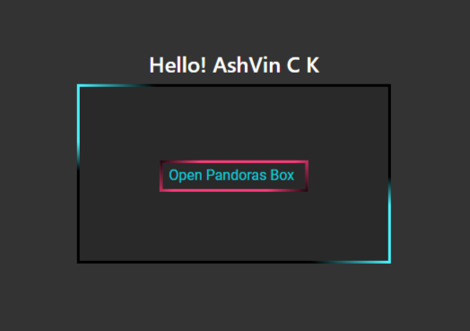

# User Auth Demo for Multiple OAuth with Firebase

This repository provides a user authentication system for various social media applications like Google, Facebook, and GitHub using Firebase. It also includes a "Forgot Password" feature that allows users to reset their passwords via email. Additionally, the app allows new users to register and existing users to log in without using any social media providers.

## Features

- Sign in with Google: Users can sign in to the app using their Google accounts.
- Sign in with Facebook: Users can sign in to the app using their Facebook accounts.
- Sign in with GitHub: Users can sign in to the app using their GitHub accounts.
- Email and password authentication: Users can register and log in using their email addresses and passwords.
- Forgot Password: Users can reset their passwords by providing their email address and following the instructions in the password reset email.

## Installation

1. Clone the repository:

   ```shell
   git clone https://github.com/ashvinck/capstone-frontend.git
   ```

2. Navigate to the project directory:

   ```shell
   cd capstone-frontend
   ```

3. Install the dependencies:

   ```shell
   npm install
   ```

4. Configure Firebase:

   - Create a new Firebase project at [https://console.firebase.google.com](https://console.firebase.google.com) and obtain your Firebase configuration settings.
   - Replace the Firebase configuration settings in the `src/firebase/firebaseConfig.js` file with your own.

5. Start the development server:

   ```shell
   npm start
   ```

   The app will be available at [http://localhost:3000](http://localhost:3000).

## Usage

1. Sign in with social media providers:
   - Click on the respective social media buttons (Google, Facebook, or GitHub) on the login page.
   - If you haven't already signed in to the selected social media provider, you will be redirected to its login page.
   - After successful authentication, you will be redirected back to the app and logged in.

2. Register and log in without social media providers:
   - Click on the "Sign Up" link on the login page.
   - Fill in the required information (email and password) in the registration form.
   - Click on the "Sign Up" button to create a new account and log in.

3. Forgot Password:
   - Click on the "Forgot Password?" link on the login page.
   - Enter your email address in the provided field.
   - Click on the "Reset Password" button.
   - Check your email inbox for a password reset email.
   - Follow the instructions in the email to reset your password.

## Contributing

Contributions are welcome! If you find any issues or have suggestions for improvements, please feel free to open an issue or submit a pull request.

## License

This project is licensed under the [MIT License](LICENSE).

## Credits

This project was created by [ASHVIN C K](https://github.com/ashvinck). I would also like to express my sincere gratitude to all the open-source contributers for their contribution without them  various functionalities used in this app wouldn't have been made possible.


## Demo



---
